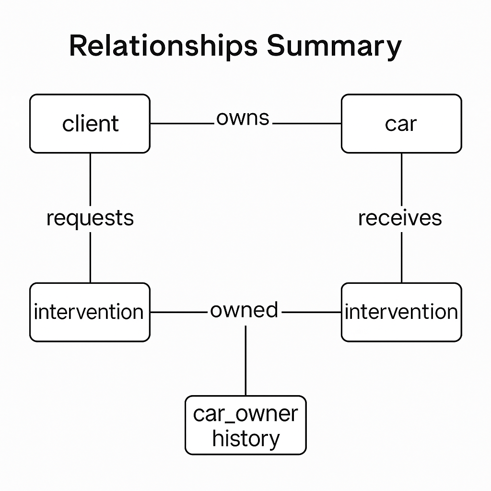

# 📚  Pipauto Database Overview

## 🧩 Core Concept

The database tracks:

- **Clients** who own cars.

- **Cars** that receive repairs or maintenance.

- **Interventions** performed on those cars.

- **Ownership history**, logging all past owners of a car.

Each table is tightly connected to reflect real-world relationships between car owners, their vehicles, and maintenance history.

## 🗃️ Tables Overview

1. client
Represents an individual or entity that owns one or more cars.

**Key fields:**

- `first_name`, `last_name`, `full_name` 

- `email`, `phone` 

- `address` (structured object)

- `created_at`, `updated_at` 

**Relations:**

- Linked to multiple `car` records (via `car.client_id`)

- Linked to multiple `intervention` records (via `intervention.client`)

- Linked to multiple `car_owner_history` records

---

2. car
Stores data about each vehicle, including its specifications and owner.

**Key fields:**

- `brand`, `model`, `year` 

- `cc` (engine size), `fuel`, `oil_type`, `oil_quantity` 

- `client_id` (current owner)

- `created_at`, `updated_at` 

**Relations:**

- Belongs to one `client` 

- Linked to multiple intervention records (via `intervention.car_id`)

- Linked to `car_owner_history` entries

3. intervention
Logs each maintenance or repair operation performed on a car.

**Key fields:**

- `car_id`: target vehicle

- `client`: the client who initiated or approved the work

- `intervention_date`, mileage, price

- `intervention_type`: flexible (structured `Maintenance` or string `Repair`)

- `remark[]`: list of notes

- `created_at`, updated_at

**Relations:**

- Belongs to one `car` 

- Belongs to one `client` 

4. car_owner_history
Records past ownership links between cars and clients.

**Key fields:**

- `car`: the car reference

- `client`: the owner at that time

- `created_at`: timestamp of the ownership assignment

**Purpose:**

- Historical audit trail to track ownership changes over time

- Complements **car.client_id**, which reflects only the current owner

## 🔗 Relationships Summary

## ⚙️ General Notes

- All fields in all tables have full permissions.

- Timestamps (`created_at`, `updated_at`) are automatically managed.

- Flexible data structures are used for fields like `intervention_type` and `address`.

- Full-text search indexes exist on key fields of `client` (e.g. name, email, phone).
